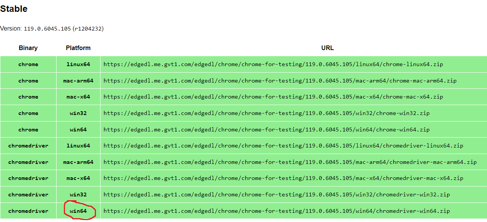
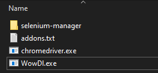

# Wow DL

Automate downloading wow addons without having to use the usual adware apps.

## Requirements

You will need to download a chromedriver exe whose version matches your installed
version of chrome. Chances are you can just download the stable version.

https://googlechromelabs.github.io/chrome-for-testing/

Assuming you are on x64 windows, copy the url from the chromedriver win64 row
to download it. Copy chromedriver.exe from the .zip file and place it alongside
the wowdl binary.



## Configure

Place a file called `addons.txt` alongside the wowdl binary. Here is an example:

```
C:\Users\user\Downloads
C:\Program Files (x86)\World of Warcraft\_retail_\Interface\AddOns
https://www.curseforge.com/wow/addons/mythic-dungeon-tools
https://www.curseforge.com/wow/addons/details
https://www.curseforge.com/wow/addons/big-wigs
https://www.curseforge.com/wow/addons/little-wigs
https://www.curseforge.com/wow/addons/weakauras-2
https://www.curseforge.com/wow/addons/pettracker
https://www.curseforge.com/wow/addons/mythic-dungeon-tools
https://www.curseforge.com/wow/addons/battle_pet_breedid
```

The first line is the directory where your browser downloads files.

The second is the location of your wow addon directory.

The rest of the lines are the curseforge urls of the addons you want.

Your final directory setup should look like the following:


